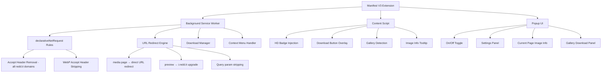

# Reddit Image Saver - Architecture & Implementation Plan

## Problem Statement

Reddit compresses and downgrades images uploaded by users. When someone right-clicks "Open image in new tab" on Reddit, instead of getting the original file, they get:
1. An HTML wrapper page (`www.reddit.com/media?url=...`) instead of the raw image
2. WebP-converted, resolution-capped previews (`preview.redd.it`) instead of originals (`i.redd.it`)
3. No easy way to download the original HD image the OP uploaded

This is especially painful for editing subreddits where people need the original quality photo.

## Competitive Analysis

| Feature | Reddit Image Opener | View Reddit Images Directly | Display Reddit Images Natively | **Ours** |
|---|---|---|---|---|
| Remove Accept header bypass | ✅ i.redd.it, preview, external-preview | ❌ | ✅ + cf.preview | ✅ All domains |
| Media page redirect | ❌ | ✅ reddit.com/media → direct | ❌ | ✅ |
| Upgrade preview → original | ❌ | ✅ (setting) | ❌ | ✅ Auto |
| WebP prevention | ❌ | ❌ | ❌ | ✅ |
| Download button | ❌ (removed in v2) | ❌ | ❌ | ✅ |
| Gallery support | ❌ | ❌ | ❌ | ✅ |
| Context menu save | ❌ | ❌ | ❌ | ✅ |
| Quality indicator | ❌ | ❌ | ❌ | ✅ |
| Settings UI | ❌ | ✅ Basic | ❌ | ✅ Full |
| Cloudflare CDN | ❌ | ❌ | ✅ | ✅ |
| Manifest V3 | ✅ | ✅ | ✅ | ✅ |

## Reddit Image URL Patterns

```
Original:           i.redd.it/{id}.{png|jpg|gif}
Preview:            preview.redd.it/{id}-{hash}.{ext}?width=X&format=Y&auto=webp&s=Z
External Preview:   external-preview.redd.it/{hash}.{ext}?width=X&auto=webp&s=Z
Cloudflare Preview: cf.preview.redd.it/{hash}.{ext}?...
Media Wrapper:      www.reddit.com/media?url={encoded_image_url}
Gallery API:        www.reddit.com/comments/{post_id}.json → gallery_data.items[]
```

### URL Transformation Rules

```
preview.redd.it/{id}-{hash}.{ext}?...  →  i.redd.it/{id}.{ext}
www.reddit.com/media?url={encoded_url}  →  {decoded_url}
Strip params: ?width=X&format=Y&auto=webp&s=Z
```

## Extension Architecture



## File Structure

```
reddit-image-saver/
├── manifest.json
├── background/
│   ├── service-worker.js          # Main background script
│   ├── rules.js                   # declarativeNetRequest rule definitions
│   ├── redirect-engine.js         # URL transformation logic
│   ├── download-manager.js        # Download handling
│   └── context-menu.js            # Right-click menu setup
├── content/
│   ├── content.js                 # Main content script
│   ├── gallery-detector.js        # Gallery post detection and URL extraction
│   ├── image-enhancer.js          # HD badges, tooltips, download buttons
│   └── content.css                # Styles for injected UI elements
├── popup/
│   ├── popup.html                 # Extension popup
│   ├── popup.js                   # Popup logic
│   └── popup.css                  # Popup styles
├── options/
│   ├── options.html               # Full settings page
│   ├── options.js
│   └── options.css
├── shared/
│   ├── url-utils.js               # URL parsing and transformation utilities
│   ├── constants.js               # Domain lists, regex patterns
│   └── storage.js                 # Chrome storage wrapper
├── icons/
│   ├── Reddit Image Saver_16.png
│   ├── Reddit Image Saver_32.png
│   ├── Reddit Image Saver_48.png
│   ├── Reddit Image Saver_64.png
│   └── Reddit Image Saver_128.png
├── _locales/
│   └── en/
│       └── messages.json
├── privacy-policy.md
└── README.md
```

## Implementation Phases

### Phase 1: Project Foundation
- Initialize project with Manifest V3 structure
- Create [`manifest.json`](manifest.json) with permissions: `declarativeNetRequest`, `activeTab`, `contextMenus`, `downloads`, `storage`
- Host permissions for `*://*.redd.it/*` and `*://www.reddit.com/*`
- Set up icon placeholders

### Phase 2: Core Header Modification - Accept Header Bypass
The key technique used by existing extensions. When Reddit sees `Accept: text/html` in the request, it serves an HTML wrapper page. Removing or modifying the Accept header forces the raw image response.

**Rules to implement in [`background/rules.js`](background/rules.js):**
- Rule 1: Remove Accept header for `i.redd.it` main_frame requests
- Rule 2: Remove Accept header for `preview.redd.it` main_frame requests
- Rule 3: Remove Accept header for `external-preview.redd.it` main_frame requests
- Rule 4: Remove Accept header for `cf.preview.redd.it` main_frame requests

### Phase 3: URL Redirect Engine
Goes beyond existing extensions by actively upgrading URLs to originals.

**In [`background/redirect-engine.js`](background/redirect-engine.js):**
- Intercept `www.reddit.com/media?url=*` → decode and redirect to direct image URL
- Intercept `preview.redd.it/*` → transform to `i.redd.it/*` original URL
- Strip quality-degrading query parameters: `width`, `format`, `auto=webp`, `crop`, `s`

### Phase 4: WebP Prevention
- Modify outgoing Accept headers to remove `image/webp` preference for Reddit image domains
- This forces Reddit CDN to serve original PNG/JPEG instead of WebP conversion

### Phase 5: Download Features
**Context menu in [`background/context-menu.js`](background/context-menu.js):**
- Add "Save Original HD Image" to right-click menu on Reddit pages
- Resolves the original i.redd.it URL before downloading
- Uses original filename from URL path

**Download overlay in [`content/image-enhancer.js`](content/image-enhancer.js):**
- Inject a small download button on hover over Reddit image posts
- Button triggers download of original quality image

### Phase 6: Gallery Support
**In [`content/gallery-detector.js`](content/gallery-detector.js):**
- Detect gallery posts by checking for gallery DOM elements or URL pattern
- Fetch post JSON from Reddit API: `{post_url}.json`
- Extract `gallery_data.items[]` → map `media_id` to `i.redd.it/{media_id}.{ext}`
- Provide "Download All" button in popup and on-page

### Phase 7: Popup UI
**In [`popup/popup.html`](popup/popup.html):**
- Master on/off toggle
- Current page info: detected images count, resolution, format
- Quick settings: prefer original, auto-redirect, format preference
- Gallery panel: list images with "Download All" button

### Phase 8: Content Script Enhancements
**In [`content/content.js`](content/content.js):**
- Inject small "HD" badge on image posts where original is available
- Hover tooltip showing: original resolution, format, file size
- Option to replace preview thumbnails with full-res on demand

### Phase 9: Testing
- Test all Reddit image URL patterns
- Test across old.reddit.com, new Reddit, sh.reddit.com
- Test gallery posts with 2+ images
- Performance profiling to ensure no page load impact

### Phase 10: Publishing
- Chrome Web Store listing copy and screenshots
- Privacy policy - zero data collection
- Package as .zip for submission
- README with installation and feature documentation

## Key Technical Decisions

1. **Manifest V3** - Required for Chrome Web Store, uses declarativeNetRequest instead of webRequest
2. **declarativeNetRequest for header modification** - More performant than content script approaches, works before page loads
3. **Hybrid approach** - Static rules for header modification + dynamic rules for URL redirects
4. **Content script for UI** - Injected elements for download buttons and badges
5. **Chrome Storage API** - For persisting user settings across sessions
6. **No external dependencies** - Pure vanilla JS, no build step needed
7. **No data collection** - Extension operates entirely client-side

## Settings Schema

```json
{
  "enabled": true,
  "preferOriginal": true,
  "autoRedirect": true,
  "preventWebP": true,
  "showHDBadge": true,
  "showDownloadButton": true,
  "downloadFormat": "original",
  "galleryAutoDetect": true
}
```
